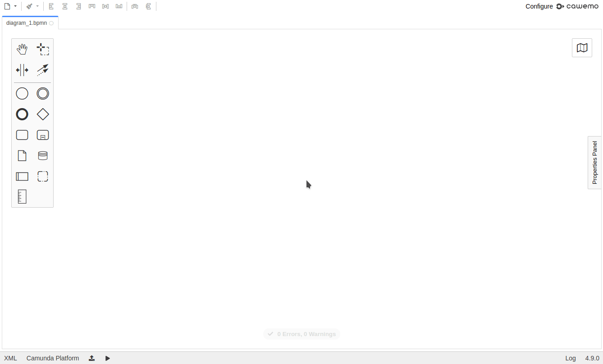
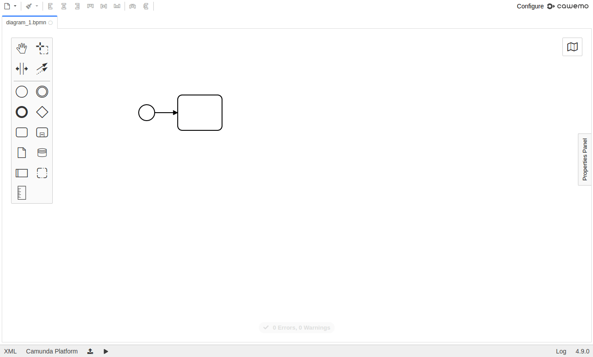

# Camunda Modeler Templates from Palette Plugin

 

A plugin for the [Camunda Modeler](https://github.com/camunda/camunda-modeler)
which allows you to directly create templated elements from the palette. It re-uses
existing [element templates](https://github.com/camunda/camunda-modeler/tree/develop/docs/element-templates).

## How to use

The plugin allows you to create templated elements using the `Palette` or the
`ContextPad`:

#### Via the Palette

#### Via the Context Pad

## How to install

Clone this repository into the [`plugins` directory](https://github.com/camunda/camunda-modeler/tree/develop/docs/plugins)
of your Camunda Modeler installation.

## Limitations

With this plugin you can directly create templates elements from the palette. However,
the following element template setups are not supported and templates which fall
under one of these, will not be offered for direct creation:

* Element Templates for `bpmn:Process`, `bpmn:Collaboration`, `bpmn:SequenceFlow`, or
  `bpmn:MessageFlow`.
* Element Templates with multiple `appliesTo` options.
